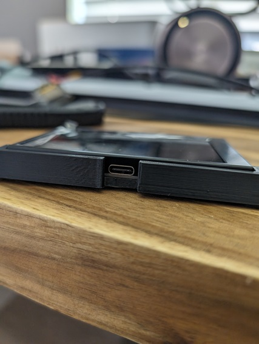
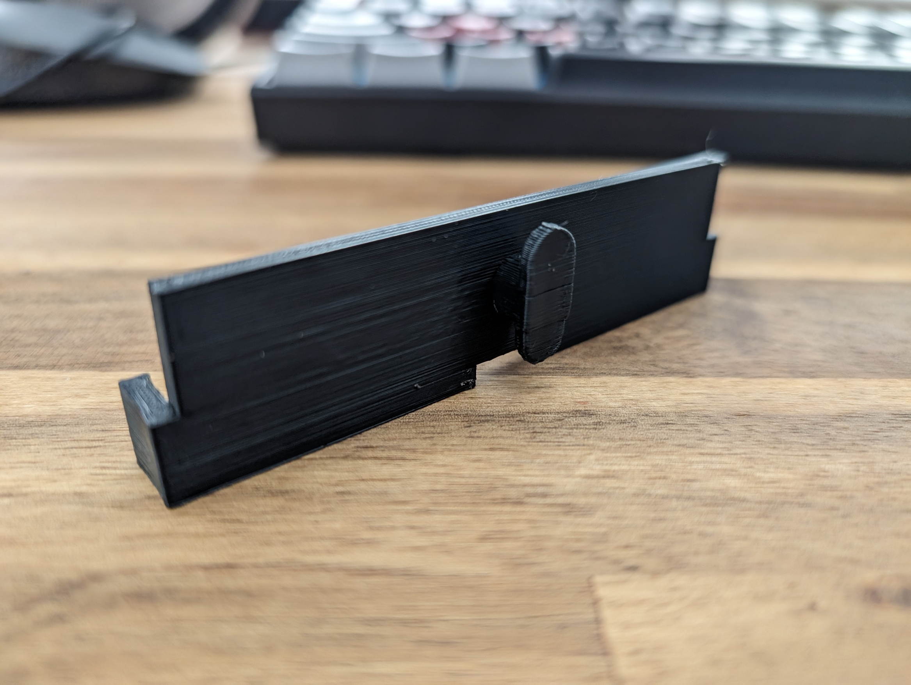
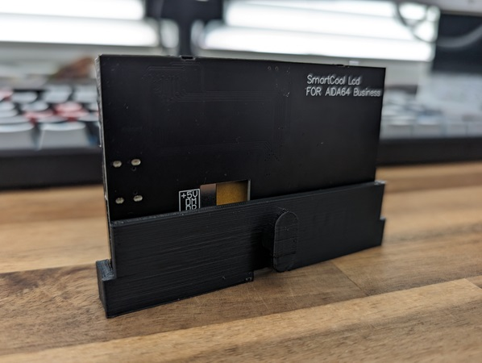
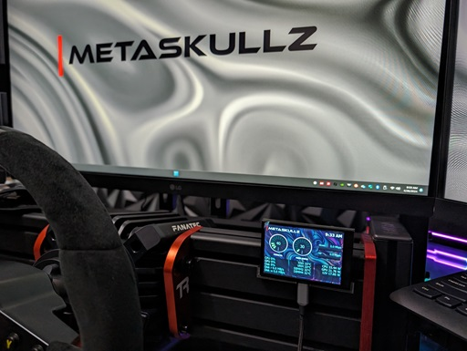
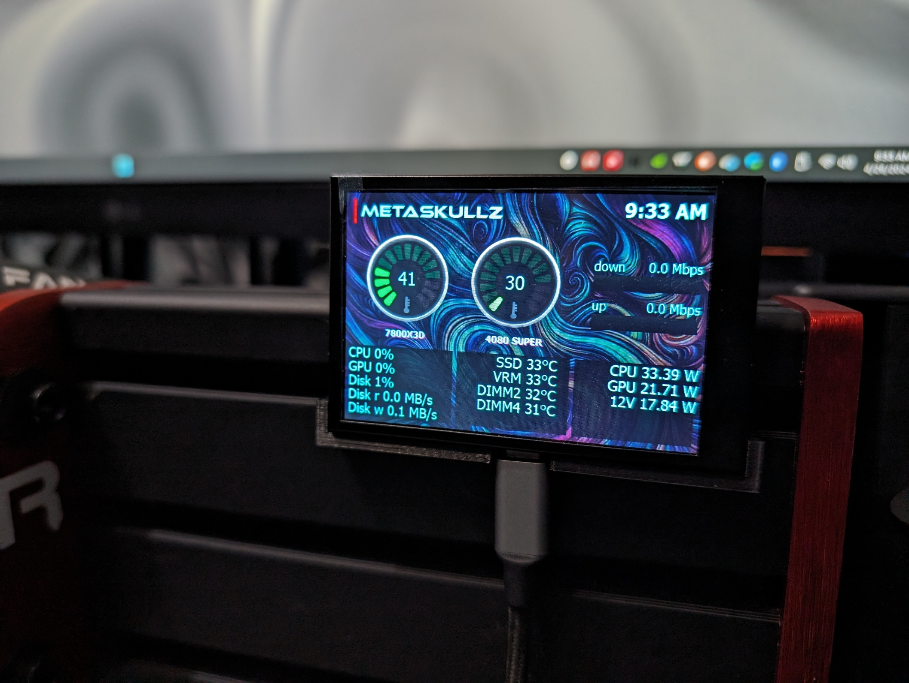
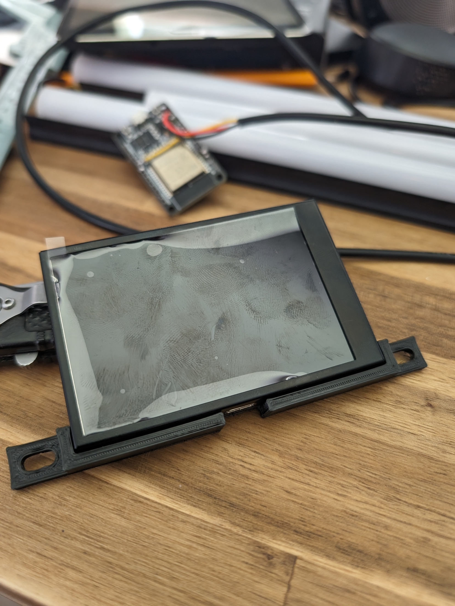

# Extrusion Monitor Mount

ExtrusionMonitorMount is a 3D printable project designed specifically for sim racing and sim flying enthusiasts. This customizable mount securely holds a 3.5" SmartCool AX206 LCD onto 2020, 2040, 4040 or 4060 aluminum extrusions commonly used in DIY simulator rigs for viewing your AID64 hardware stats on the fly. This mount ensures your monitor stays firmly in place and is the perfect solution for integrating a monitor seamlessly into your simulated cockpit setup. One model features tabs for fastening with M4 hardware. The other features a tab that twist locks into the slotted extrusion.

## Print Settings

**Brand** `ELEGOO`

**Model** `NEPTUNE 3 Max`

**Supports** `Tree`

**Notes** `Print in upright orientation with tree supports`

## Authors

[@upioneer](https://www.github.com/upioneer)

## Related

[UltiMaker Thingiverse designs](https://www.thingiverse.com/upioneer/designs)

##

