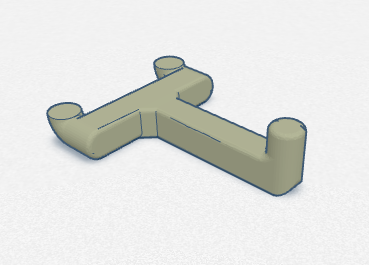
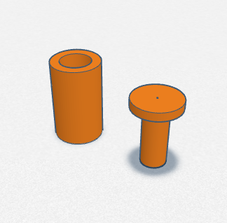
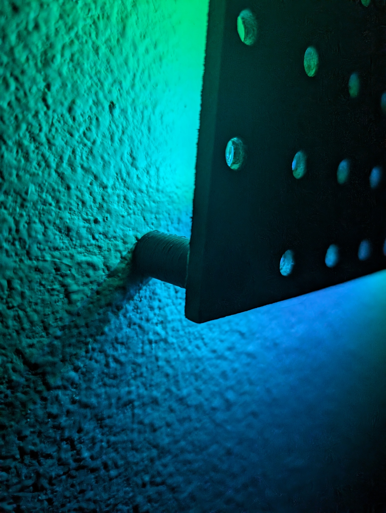
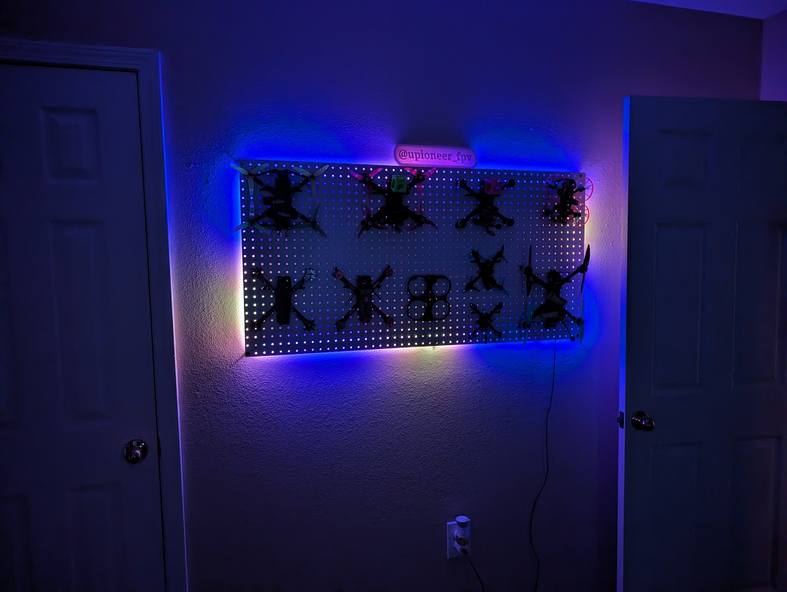
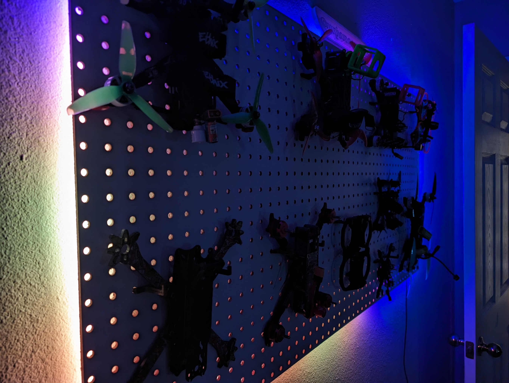

# Peg Board hook and stand off

## Printer Settings

**Brand** `ELEGOO`

**Model** `NEPTUNE 3 Max`

**Supports** `None`

**Layer Height** `0.2mm`

**Infill** `50% or higher`

**Notes** `TBD`

## Printing Tips
- Ensure your printer is calibrated properly for accurate dimensions
- Use the appropriate filament for the desired strength and finish
- Post-process the printed parts as needed (sanding, painting, etc)

##

## Authors

[@upioneer](https://www.github.com/upioneer)

## Related

[UltiMaker Thingiverse designs](https://www.thingiverse.com/upioneer/designs)

## Additional Photos

